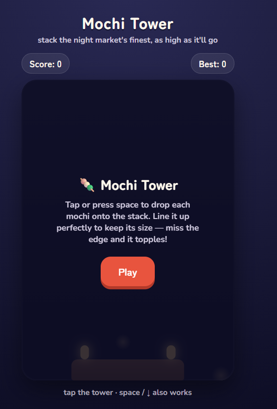
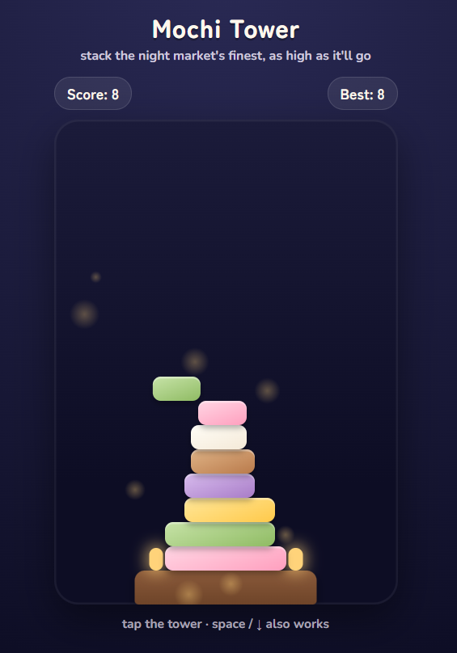
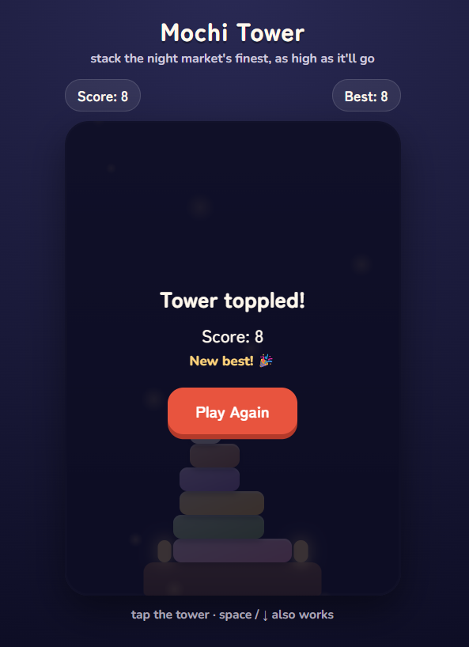

# 🍡 Mochi Tower

A fun and addictive browser-based stacking game inspired by Japanese night markets. Carefully drop colorful mochi pieces onto the tower, align them perfectly, and build the tallest stack possible before it topples!

---

## 📸 Preview

| Start Screen | Gameplay | Game Over |
|--------------|----------|-----------|
|  |  |  |
---

## ✨ Features

- 🍡 Beautiful Japanese-inspired night market theme
- 🎮 Simple one-tap / one-key gameplay
- 🏆 High score tracking with persistent storage
- ✨ Perfect drop bonus with glowing animations
- 🎆 Floating particle and bokeh background effects
- 📱 Responsive design for desktop and mobile
- ⌨️ Keyboard and touch controls
- 🌙 Smooth animations and transitions
- 💾 Best score saved automatically in browser storage
- 🎨 Colorful randomly generated mochi blocks

---

## 🎯 How to Play

1. Press **Play** to begin.
2. Watch the moving mochi block.
3. Click anywhere on the game area or press:

```
Space
↓ Arrow Key
Enter
```

to drop the block.

4. Align it with the block below.

5. Perfect alignment keeps the block full size.

6. Missing the edges trims the block.

7. Miss completely and your tower topples!

---

## 🛠️ Built With

- HTML5
- CSS3
- Vanilla JavaScript
- Local Storage API

---

## 📂 Project Structure

```text
Mochi-Tower/
│
├── index.html
├── README.md
└── images/
    ├── start.png
    ├── gameplay.png
    └── gameover.png
```

---

## 🚀 Getting Started

Clone the repository

```bash
git clone https://github.com/YOUR_USERNAME/mochi-tower.git
```

Open the project

```bash
cd mochi-tower
```

Launch the game by opening

```text
index.html
```

No installation or additional dependencies are required.

---

## 🎮 Controls

| Action | Control |
|---------|----------|
| Drop Block | Mouse Click |
| Drop Block | Space |
| Drop Block | ↓ Arrow |
| Start Game | Enter |

---

## 🌟 Gameplay Features

- Progressive difficulty
- Dynamic block shrinking
- Perfect placement bonuses
- Smooth camera scrolling
- Falling debris animations
- Persistent best score
- Infinite gameplay until the tower falls

---

## 💡 Future Improvements

- 🎵 Background music
- 🏅 Achievements
- 🌎 Online leaderboard
- 🍓 More mochi flavors
- 🌸 Seasonal themes
- 🎨 Multiple skins
- 🔊 Sound effects
- 📈 Difficulty levels

---

## 🤝 Contributing

Contributions are welcome!

1. Fork the repository
2. Create a feature branch

```bash
git checkout -b feature/NewFeature
```

3. Commit your changes

```bash
git commit -m "Add new feature"
```

4. Push the branch

```bash
git push origin feature/NewFeature
```

5. Open a Pull Request


---

## ❤️ Acknowledgements

Inspired by classic tower-stacking arcade games and the charm of Japanese night markets.

If you enjoyed this project, don't forget to ⭐ star the repository!